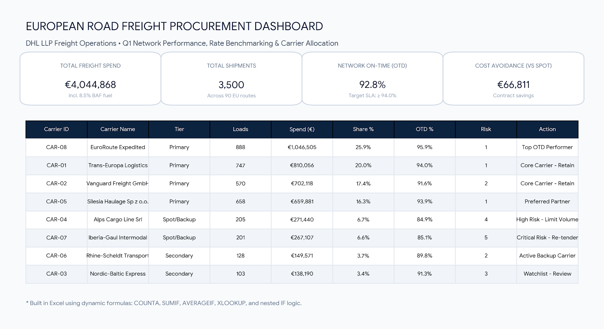
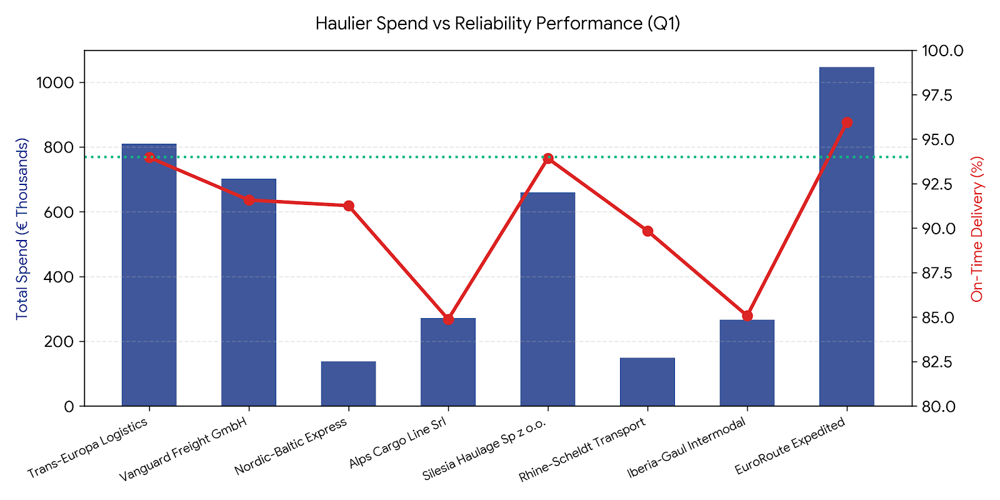

# European Road Freight Procurement Analysis 🚚

A hands-on transport procurement and cost analysis project evaluating **3,500 full-truckload (FTL) journeys** across 90 European trade corridors.



---

## Why This Project?

In European road logistics, the cheapest price on paper is rarely the cheapest price in practice.

When you manage freight contracts, you negotiate volume rates with core hauliers. But European road transport is volatile: borders jam at Dover, Alpine passes close in winter, and drivers run short. When your primary haulier turns down a load, transport planners scramble to find a truck on the open market.

**That is where profit margins quietly bleed out.** 

I wanted to dig into this commercial puzzle:
* How much money are we actually saving on our negotiated contracts?
* What does it cost the business every time a primary route fails and we fall back to secondary or emergency spot carriers?
* Which hauliers are quietly dragging down our customer delivery promises?

---

## What the Data Revealed

Analyzing €4.04M in quarterly haulage spend uncovered a stark divide in operational performance:



### 1. Primary Contracts Win, But Fallbacks Are Punishing
* **Negotiated primary loads** delivered **94.1% punctuality** and generated **€153,800 in genuine savings** against open market rates.
* **Fallback & spot bookings (637 loads)** eroded **€87,000** of those savings. On-time delivery plummeted to **86.5%**, and we paid an average **15% to 25% premium** per run.

### 2. Two Hauliers Accounted for Most of the Friction
* `CAR-04 (Alps Cargo Line)` and `CAR-07 (Iberia-Gaul Intermodal)` soaked up over **€538,000** in freight spend.
* Yet their punctuality hovered near **85%**. By failing to show up on time, they single-handedly dragged the entire network under our 94% customer SLA benchmark.

---

## Procurement Recommendations

If I were presenting these findings to the European procurement committee on Monday morning, here is the action plan:

1. **Cap Allocations to High-Risk Carriers**: Immediately freeze discretionary load allocation to Alps Cargo Line and Iberia-Gaul on Southern European corridors until reliability recovers.
2. **Launch a Mini-Tender for Backup Capacity**: Run an ad-hoc tender across vulnerable Alpine and cross-channel lanes to secure reliable secondary partners with pre-negotiated fallback rates.
3. **Lock In Core Capacity**: Re-negotiate guaranteed trailer capacity with our top performers (`EuroRoute Expedited` and `Silesia Haulage`), increasing contracted coverage from 82% to 90% to avoid €35k+ in quarterly emergency premiums.

---

## Excel Modeling Highlights

This project was built entirely in Excel to reflect everyday freight operations:

* **Two-Way XLOOKUPs**: Resolving route lookups without ambiguity:
  ```excel
  =XLOOKUP("Mannheim" & "|" & "Wrocław", Rate_Matrix!B:B & "|" & Rate_Matrix!D:D, Rate_Matrix!J:J, "Rate Not Found")
